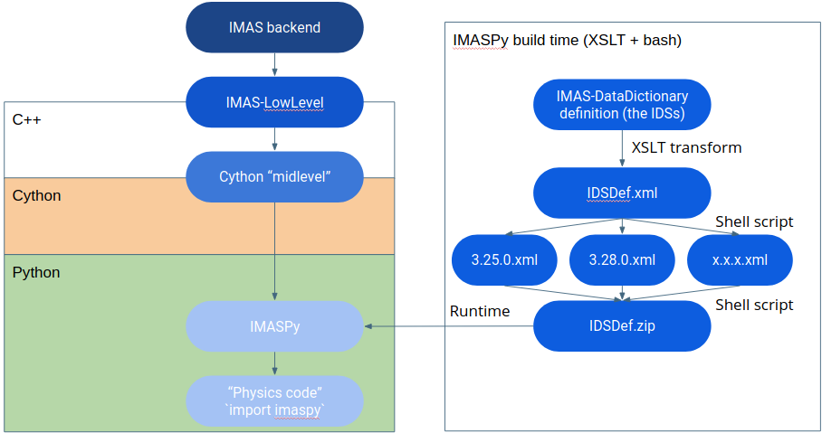
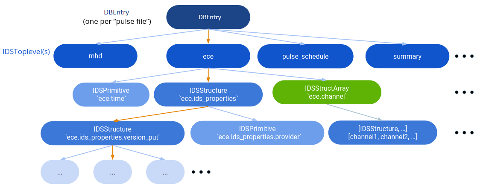

IMASPy in the IMAS ecosystem
============================

IMASPy builds on the IMAS-LowLevel Python native interface. At IMASPy build time,
a collection of data dictionaries is bundled into a file IDSDef.zip. At IMASPy
read time, all files in the proper paths named IDSDef.zip are searched for data
dictionary versions to support. Alternatively explicit paths to xml files can be
used.

IMASPy nested structure design
==============================

IMASPy uses a tree-style layout, with four container types:

- :py:class:`IDSStructure` (extended :py:class:`IDSToplevel`)
- :py:class:`IDSStructArray`
- :py:class:`IDSNumericArray`
- :py:class:`IDSPrimitive`

And a root container, :py:class:`IDSFactory`, which contains several
:py:class:`IDSToplevels`.  Only :py:class:`IDSPrimitive` and
:py:class:`IDSNumericArray` contain actual
values. They are leaf nodes and can be iterated over separately.
:py:class:`IDSNumericArray` is a special case of :py:class:`IDSPrimitive,`
containing a collection of values instead of a single 0D value. The class
subclasses both :py:class:`IDSPrimitive` and NDArrayOperatorsMixin, allowing to
create numpy array-like classes. See
https://numpy.org/doc/stable/reference/generated/numpy.lib.mixins.NDArrayOperatorsMixin.html

IMASPy usage
============

The IMASPy project defines a class :py:class:`~imaspy.ids_factory.IDSFactory` which can
be instantiated with a DD version number or xml_path. It reads the XML file and creates
the IDSs as :py:class:`IDSToplevel` classes containing :py:class:`IDSStructures`,
:py:class:`IDSStructArrays`, :py:class:`IDSPrimitives` and :py:class:`IDSNumericArrays`.

See the :ref:`IMASPy 5 minute introduction` for a short introduction on IMASPy.

.. _`Using multiple DD versions in the same environment`:

Using multiple DD versions in the same environment
==================================================

Whereas the default IMAS High Level Interface is built for a single Data Dictionary
version, IMASPy can transparently handle multiple DD versions.

By default, IMASPy uses the same Data Dictionary version as the loaded IMAS environment
is using, as specified by the environment variable ``IMAS_VERSION``. If no IMAS
environment is loaded, the last available DD version is used.

You can also explicitly specify which IMAS version you want to use when constructing a
:py:class:`~imaspy.db_entry.DBEntry` or :py:class:`~imaspy.ids_factory.IDSFactory`. For
example:

.. code-block:: python
    :caption: Using non-default IMAS versions.

    import imaspy

    factory_default = imaspy.IDSFactory()  # Use default DD version
    factory_3_32_0 = imaspy.IDSFactory("3.32.0")  # Use DD version 3.32.0

    # Will write IDSs to the backend in DD version 3.32.0
    dbentry = imaspy.DBEntry(imaspy.ids_defs.HDF5_BACKEND, "TEST", 10, 2, version="3.32.0")
    dbentry.create()

Conversion of IDSs between DD versions
--------------------------------------

IMASPy can convert IDSs between different versions of the data dictionary. This uses the
"non-backwards compatible changes" metadata from the DD definitions. You can explicitly
convert IDSs using :py:func:`imaspy.convert_ids`:

.. code-block:: python
    :caption: Convert an IDS to a different DD version

    import imaspy

    # Create a pulse_schedule IDS in version 3.23.0
    ps = imaspy.IDSFactory("3.25.0").new("pulse_schedule")
    ps.ec.antenna.resize(1)
    ps.ec.antenna[0].name = "IDS conversion test"

    # Convert the IDS to version 3.30.0
    ps330 = imaspy.convert_ids(ps, "3.30.0")
    # ec.antenna was renamed to ec.launcher between 3.23.0 and 3.30.0
    print(len(ps330.ec.launcher))  # 1
    print(ps330.ec.launcher[0].name.value)  # IDS conversion test

.. note::

    Not all data may be converted. For example, when an IDS node is removed between DD
    versions, the corresponding data is not copied. IMASPy provides logging to indicate
    when this happens.

The DBEntry class automatically converts IDSs to the requested version:

- When doing a ``put`` or ``put_slice``, the provided IDS is first converted to the
  target version of the DBEntry and then put to disk.
- When doing a ``get`` or ``get_slice``, the IDS is first read from disk in the version
  as it was stored (by checking ``ids_properties/version_put/data_dictionary``) and then
  converted to the requested target version.

Background information
----------------------

Since IMASPy needs to have access to multiple DD versions it was chosen to
bundle these with the code at build-time, in setup.py. If a git clone of the
Data Dictionary succeeds, the setup tools automatically download saxon and
generate ``IDSDef.xml`` for each of the tagged versions in the DD git
repository. These are then gathered into ``IDSDef.zip``, which is
distributed inside the IMASPy package.

To update the set of data dictionaries new versions can be added to the zipfile.
A reinstall of the package will ensure that all available versions are included
in IMASPy. Additionally an explicit path to an XML file can be specified, which
is useful for development.

Automated tests have been provided that check the loading of all of the DD
versions tagged in the data-dictionary git repository.

Extending the DD set
''''''''''''''''''''

A new command has been defined python setup.py build_DD which fetches new tags
from git and builds IDSDef.zip

The IDSDef.zip search paths have been expanded:

- ``$IMASPY_DDZIP`` (path to a zip file)
- ``./IDSDef.zip``
- ``~/.config/imaspy/IDSDef.zip`` (``$XDG_CONFIG_DIR``)
- ``__file__/../assets/IDSDef.zip`` (provided with IMASPy)

All paths are searched in order.

There are some limitations of the change_nbc paradigm:
''''''''''''''''''''''''''''''''''''''''''''''''''''''

- Forward only
- May require reading an arbitrary number of intermediate versions
- Does not cover more complex migrations

IMASPy will not load intermediate versions. Double renames are therefore not
supported yet. This does not appear to be a problem so far. If any problem
occurs the conversion can easily be done in multiple steps.

Time slicing
============

The lowlevel API provides `ual_write_slice_data` to write only a slice (in the
last dimension, time) to the backend, as well as `ual_begin_slice_action`. After
that normal `get()` can be used. We have implemented time slicing support, with
two main entry points on :py:class:`IDSToplevel`:

.. code-block:: python

    def getSlice(
        self, time_requested, interpolation_method=CLOSEST_INTERP, occurrence=0
    ):
        """Get a slice from the backend.

        @param[in] time_requested time of the slice
        - UNDEFINED_TIME if not relevant (e.g to append a slice or replace the last slice)
        @param[in] interpolation_method mode for interpolation:
        - CLOSEST_INTERP take the slice at the closest time
        - PREVIOUS_INTERP take the slice at the previous time
        - LINEAR_INTERP interpolate the slice between the values of the previous and next slice
        - UNDEFINED_INTERP if not relevant (for write operations)
        """

    def putSlice(self, occurrence=0, ctx=None):
        """Put a single slice into the backend. only append is supported"""

These setup the backend in the right state and recursively call `get()`
and `put()` to perform their duties.

Test cases have been built to verify the required behaviour, in
`imaspy/test_time_slicing.py`, on the equilibrium IDS. There is no reason to
expect different behaviour for other IDSes.

Writing slice data (single slice and multiple slices at the same time) and
verifying as a global array Reading slice by slice (single slice only) The tests
pass on the memory and MDSPlus backend (the ASCII backend does not support
slicing).

.. _`IDS validation`:

IDS validation
==============

The IDSs you fill should be consistent. To help you in validating that, IMASPy has a
:py:meth:`~imaspy.ids_toplevel.IDSToplevel.validate` method that executes the following
checks.

.. contents:: Validation checks
    :local:
    :depth: 1

If you call this method and your IDS fails validation, IMASPy raises an error explaining
the problem. See the following example:

>>> import imaspy
>>> core_profiles = imaspy.IDSFactory().core_profiles()
>>> core_profiles.validate()
imaspy.exception.ValidationError: Invalid value for ids_properties.homogeneous_time: -999999999

IMASPy also automatically validates an IDS every time you do a
:py:meth:`~imaspy.db_entry.DBEntry.put` or
:py:meth:`~imaspy.db_entry.DBEntry.put_slice`. To disable this feature, you must set the
environment variable ``IMAS_AL_DISABLE_VALIDATE`` to ``1``.

.. seealso::
    
    API documentation: :py:meth:`IDSToplevel.validate() <imaspy.ids_toplevel.IDSToplevel.validate>`

Validate the time mode
----------------------

The time mode of an IDS is stored in ``ids_properties.homogeneous_time``.
This property must be filled with a valid time mode
(``IDS_TIME_MODE_HOMOGENEOUS``, ``IDS_TIME_MODE_HETEROGENEOUS`` or
``IDS_TIME_MODE_INDEPENDENT``). When the time mode is `independent`, all time-dependent
quantities must be empty.

Validate coordinates
--------------------

If a quantity in your IDS has coordinates, then these coordinates must be filled. The
size of your data must match the size of the coordinates:

.. todo:: link to DD docs

1.  Some dimensions must have a fixed size. This is indicated by the Data Dictionary
    as, for example, ``1...3``.

    For example, in the ``magnetics`` IDS, ``b_field_pol_probe(i1)/bandwidth_3db`` has
    ``1...2`` as coordinate 1. This means that, if you fill this data field, the first
    (and only) dimension of this field must be of size 2.

2.  If the coordinate is another quantity in the IDS, then that coordinate must be
    filled and have the same size as your data.

    For example, in the ``pf_active`` IDS, ``coil(i1)/current_limit_max`` is a
    two-dimensional quantity with coordinates ``coil(i1)/b_field_max`` and
    ``coil(i1)/temperature``. This means that, if you fill this data field, their
    coordinate fields must be filled as well. The first dimension of
    ``current_limit_max`` must have the same size as ``b_field_max`` and the second
    dimension the same size as ``temperature``. Expressed in Python code:

    .. code-block:: python

        numpy.shape(current_limit_max) == (len(b_field_max), len(temperature))

    Time coordinates are handled depending on the value of
    ``ids_properties/homogeneous_time``:

    -   When using ``IDS_TIME_MODE_HOMOGENEOUS``, all time coordinates look at the root
        ``time`` node of the IDS.
    -   When using ``IDS_TIME_MODE_HETEROGENOUS``, all time coordinates look at the time
        path specified as coordinate by the Data Dictionary.

        For dynamic array of structures, the time coordinates is a ``FLT_0D`` inside the
        AoS (see, for example, ``profiles_1d`` in the ``core_profiles`` IDS). In such
        cases the time node must be set to something different than ``EMPTY_FLOAT``.
        This is the only case in which values of the coordinates are verified, in all
        other cases only the sizes of coordinates are validated.

    .. rubric:: Alternative coordinates

    Version 4 of the Data Dictionary introduces alternative coordinates. An
    example of this can be found in the ``core_profiles`` IDS in
    ``profiles_1d(itime)/grid/rho_tor_norm``. Alternatives for this coordinate
    are:
    
    -   ``profiles_1d(itime)/grid/rho_tor``
    -   ``profiles_1d(itime)/grid/psi``
    -   ``profiles_1d(itime)/grid/volume``
    -   ``profiles_1d(itime)/grid/area``
    -   ``profiles_1d(itime)/grid/surface``
    -   ``profiles_1d(itime)/grid/rho_pol_norm``

    Multiple alternative coordinates may be filled (for example, an IDS might
    fill both the normalized and non-normalized toroidal flux coordinate). In
    that case, the size must be the same.

    When a quantity refers to this set of alternatives (for example
    ``profiles_1d(itime)/electrons/temperature``), at least one of the
    alternative coordinates must be set and its size must match the size of the
    quantity.

3.  The Data Dictionary can indicate exclusive alternative coordinates. See for
    example the ``distribution(i1)/profiles_2d(itime)/density(:,:)`` quantity in the
    ``distributions`` IDS, which has as first coordinate
    ``distribution(i1)/profiles_2d(itime)/grid/r OR
    distribution(i1)/profiles_2d(itime)/grid/rho_tor_norm``. This means that
    either ``r`` or ``rho_tor_norm`` can be used as coordinate.
    
    Validation works the same as explained in the previous point, except that
    exactly one of the alternative coordinate must be filled. Its size must, of
    course, still match the size of the data in the specified dimension.

4.  Some quantites indicate a coordinate must be the same size as another quantity
    through the property ``coordinateX_same_as``. In this case, the other quantity is
    not a coordinate, but their data is related and must be of the same size.

    An example can be found in the ``edge_profiles`` IDS, quantity
    ``ggd(itime)/neutral(i1)/velocity(i2)/diamagnetic``. This is a two-dimensional field
    for which the first coordinate must be the same as
    ``ggd(itime)/neutral(i1)/velocity(i2)/radial``. When the diamagnetic velocity
    component is filled, the radial component must be filled as well, and have a
    matching size.

Resampling
==========

For resampling of data we stick close to the numpy and scipy APIs. The relevant
method signatures are reproduced here:

.. code-block:: python

    Class scipy.interpolate.interp1d(x, y, kind='linear', axis=- 1, copy=True,
        bounds_error=None, fill_value=nan, assume_sorted=False)

Which produces a resampling function, whose call method uses interpolation to
find the value of new points. This can be used like so:

.. code-block:: python

    pulse_schedule = IDSFactory().new("pulse_schedule")
    f = scipy.interpolate.interp1d(pulse_schedule.time, pulse_schedule_some_1d_var)
    ids.pulse_schedule.some_1d_var = f(pulse_schedule.some_1d_var)

A more general approach would work on the basis of scanning the tree for
shared coordinates, and resampling those in the same manner (by creating a
local interpolator and applying it). The

.. code-block:: python

    visit_children(self, fun, leaf_only):

method defined on :py:class:`IDS_structure` and :py:class:`IDS_toplevel` can
be used for this. For a proof-of-concept it is recommended to only resample
in the time direction.

For example, a proposal implementation included in 0.4.0 can be used as such
(inplace interpolation on an IDS leaf node)

.. code-block:: python

    nbi = imaspy.IDSFactory().new("nbi")
    nbi.ids_properties.homogeneous_time = IDS_TIME_MODE_HOMOGENEOUS
    nbi.time = [1, 2, 3]
    nbi.unit.resize(1)
    nbi.unit[0].energy.data = 2 * nbi.time
    old_id = id(nbi.unit[0].energy.data)

    assert nbi.unit[0].energy.data.time_axis == 0

    imaspy.util.resample(
        nbi.unit[0].energy.data,
        nbi.time,
        [0.5, 1.5],
        nbi.ids_properties.homogeneous_time,
        inplace=True,
        fill_value="extrapolate",
    )

    assert old_id == id(nbi.unit[0].energy.data)
    assert nbi.unit[0].energy.data == [1, 3]

Or as such (explicit in-memory copy + interpolation, producing a new data leaf/container):

.. code-block:: python

    nbi = imaspy.IDSFactory().new("nbi")
    nbi.ids_properties.homogeneous_time = IDS_TIME_MODE_HOMOGENEOUS
    nbi.time = [1, 2, 3]
    nbi.unit.resize(1)
    nbi.unit[0].energy.data = 2 * nbi.time
    old_id = id(nbi.unit[0].energy.data)

    assert nbi.unit[0].energy.data.time_axis == 0

    new_data = imaspy.util.resample(
        nbi.unit[0].energy.data.resample,
        nbi.time,
        [0.5, 1.5],
        nbi.ids_properties.homogeneous_time,
        inplace=False,
        fill_value="extrapolate",
    )

    assert old_id != id(new_data)
    assert new_data == [1, 3]

Implementation unit tests can be found in `test_latest_dd_resample.py`.

Alternative resampling methods
------------------------------

.. code-block:: python

    scipy.signal.resample(x, num, t=None, axis=0, window=None, domain='time')

`Scipy.signal.resample` uses a Fourier method to resample, which assumes the
signal is periodic. It can be very slow if the number of input or output
samples is large and prime. See
https://docs.scipy.org/doc/scipy/reference/generated/scipy.signal.resample.html
for more information.

.. code-block:: python

    scipy.signal.resample_poly(x, up, down, axis=0, window='kaiser', 5.0, padtype='constant', cval=None)

Could be considered, which uses a low-pass FIR filter. This assumes zero
values outside the boundary. See
https://docs.scipy.org/doc/scipy/reference/generated/scipy.signal.resample_poly.html#scipy.signal.resample_poly
for more information.  We do not recommend to use simpler sampling methods
such as nearest-neighbour if possible, as this reduces the data quality and
does not result in a much simpler or faster implementation if care is taken.
