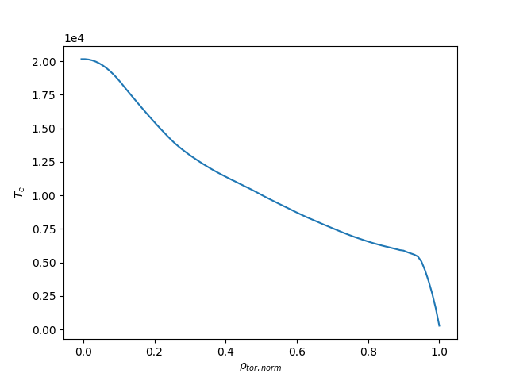

Analyze with IMASPy
===================

Loading IMAS data
-----------------

For this part of the training we will learn to open an IMAS database entry, and
plot some basic data in it using `matplotlib <https://matplotlib.org/>`_.

Open an IMAS database entry
'''''''''''''''''''''''''''

IMAS explicitly separates the data on disk from the data in memory. To get
started we load an existing IMAS data file from disk. The on-disk file
is represented by an :class:`imaspy.DBEntry`, which we have to
:meth:`~imaspy.db_entry.DBEntry.open()` to get a reference to the data file we
will manipulate. The connection to the data file is kept intact until we neatly
:meth:`~imaspy.db_entry.DBEntry.close()` the file. Note that the on-disk file
will not be changed until an explicit :meth:`~imaspy.db_entry.DBEntry.put()` or
:meth:`~imaspy.db_entry.DBEntry.put_slice()` is called.
We load data in memory with the :meth:`~imaspy.db_entry.DBEntry.get()` and
:meth:`~imaspy.db_entry.DBEntry.get_slice()` methods, after which we
can use the data.

.. hint::
    Use the ASCII data supplied with IMASPy for all exercises. It contains two
    IDSs (``equilibrium`` and ``core_profiles``) filled  with data from three
    time slices of ITER reference data. Two convenience methods are available in the
    :mod:`imaspy.training` module to open the DBEntry for this training data.

    1. :meth:`imaspy.training.get_training_db_entry()` returns an opened
       ``imaspy.DBEntry`` object. Use this method if you want to use the IMASPy
       interface.
    2. :meth:`imaspy.training.get_training_imas_db_entry()` returns an opened
       ``imas.DBEntry`` object. Use this method if you want to use the Python Access
       Layer interface.

.. tabs::

    .. tab:: Exercise
        Open the training database entry: ``entry = imaspy.training.get_training_db_entry()``

        1. Load the ``equilibrium`` IDS into memory using the ``get`` function
        2. Read and print the ``time`` array of the ``equilibrium`` IDS
        3. Load the ``core_profiles`` IDS into memory
        4. Explore the ``core_profiles.profiles_1d`` property and try to match :math:`t\approx 433\mathrm{s}`
           to one of the slices
        5. Read and print the 1D electron temperature profile (:math:`T_e`) from the
           ``core_profiles`` IDS at time slice :math:`t\approx 433\mathrm{s}`

    .. tab:: AL4
        .. literalinclude:: al4_snippets/read_whole_equilibrium.py

    .. tab:: IMASPy
        .. literalinclude:: imaspy_snippets/read_whole_equilibrium.py

.. caution::
   When dealing with unknown data, it can be dangerous to blindly load data.
   Especially when dealing with larger data files, this might fill up the RAM of your
   machine quickly. The ASCII files supplied with IMASPy are small specifically
   for this purpose. IMASPy will allow to load a part of the data in the future
   using lazy-loading, see
   `IMAS-4506 <https://jira.iter.org/browse/IMAS-4506>`_.

.. tabs::
    .. tab:: Exercise
        Write a function that finds the closest time slice index to :math:`t=433\mathrm{s}`
        inside the ``equilibrium`` IDS. Use the ``equilibrium.time`` property

        .. hint::
            :collapsible:

            Create an array of the differences between the ``equilibrium.time``
            array and your search term (:math:`t=433\mathrm{s}`)

            Now the index of the closest time slice can be found with
            ``np.argmin``

    .. tab:: AL4
        .. literalinclude:: al4_snippets/read_equilibrium_time_array.py

    .. tab:: IMASPy
        .. literalinclude:: imaspy_snippets/read_equilibrium_time_array.py

.. attention::
    IMASPy objects generally behave the same way as numpy arrays. However, in
    some cases functions explicitly expect a pure numpy array. In this case, the
    ``.value`` attribute can be used to obtain the underlying data array.

    We are investigating options for improving the API (which may reduce, but
    not eliminate, the need for ``.value``). Progress for this can be followed
    on `IMAS-4680 <https://jira.iter.org/browse/IMAS-4680>`_.

.. note::
    IMASPy has two main ways of accessing IDSs. In the exercises above, we used
    the "attribute-like" access. This is the main way of navigating the IDS tree.
    However, IMASPy also provides a "dict-like" interface to access data, which
    might be more convenient in some cases. For example:

    .. literalinclude:: imaspy_snippets/iterate_core_profiles.py

Using multiple IDSs
'''''''''''''''''''

If the data structure is too large and it order to save time and memory, one can
decide to only load the :math:`T_e` profile of the ``core_profiles`` IDS at
``t=433s``. As before, one has to know that it corresponds to ``index=1`` of
the ``core_profiles.time`` array, which can be found with the method above. This
assumes that the ``equilibrium`` and ``core_profiles`` IDSs are defined on the
same time array, which is not necessarily the case. Always check this when
working with random data!

.. tabs::
    .. tab:: Exercise
        Only assign the data you need to python variables and print
        ``core_profiles`` :math:`T_e` and :math:`\rho_{tor, norm}` at
        ``index=1``
    .. tab:: AL4
        .. literalinclude:: al4_snippets/read_core_profiles_te_timeslice.py

    .. tab:: IMASPy
        .. literalinclude:: imaspy_snippets/read_core_profiles_te_timeslice.py

Now we can plot the :math:`T_e` profile obtained above:

.. tabs::
    .. tab:: Exercise
        Using ``matplotlib``, create a plot of :math:`T_e` on the y-axis and
        :math:`\rho_{tor, norm}` on the x-axis.
    .. tab:: AL4
        .. literalinclude:: al4_snippets/plot_core_profiles_te_timeslice.py

    .. tab:: IMASPy
        .. literalinclude:: imaspy_snippets/plot_core_profiles_te_timeslice.py

    A plot of :math:`T_e` vs :math:`\rho_{tor, norm}`
