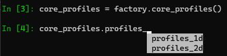

Explore with IMASPy
===================

In this part of the training, we will learn how to use Python to explore data
saved in IDSs.

Explore which IDSs are available
--------------------------------

Most codes will touch multiple IDSs inside a single IMAS data entry. For example
a heating code using a magnetic equilibrium from the ``equilibrium`` IDS with a
heating profile from the ``core_sources`` IDS. To find out how to write your
code, there are two main strategies: read the
`Data Model <https://confluence.iter.org/display/IMP/Data+Model>`_ documents of
the `Data Dictionary
<https://portal.iter.org/departments/POP/CM/IMDesign/Data%20Model/CI>`_
or explore the data interactively. We will focus on the latter method here.

.. tabs::
    .. tab:: Exercise
        Find out the names of the available IDSs.

    .. tab:: AL4
        .. literalinclude:: al4_snippets/print_idss.py

    .. tab:: IMASPy
        .. literalinclude:: imaspy_snippets/print_idss.py

Explore the structure and contents of an IDS
--------------------------------------------

.. tabs::
    .. tab:: Exercise
        Write some text here

    .. tab:: AL4
        .. literalinclude:: al4_snippets/explore_content.py

    .. tab:: IMASPy
        .. literalinclude:: imaspy_snippets/explore_content.py

Interactive exploration

Load an IDS and explore which data exists
-----------------------------------------
